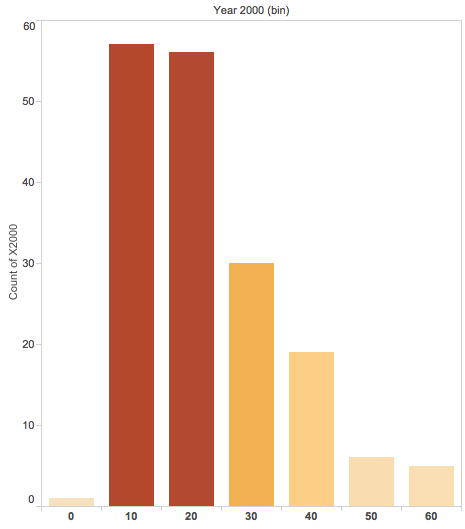
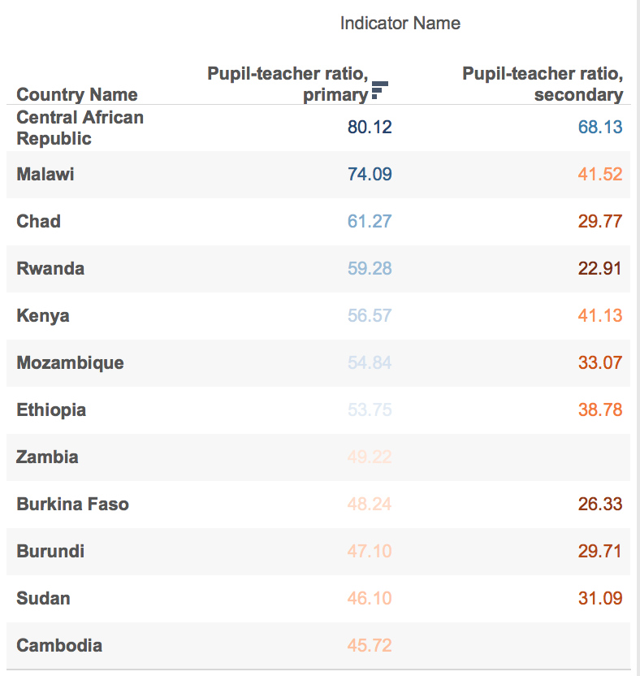
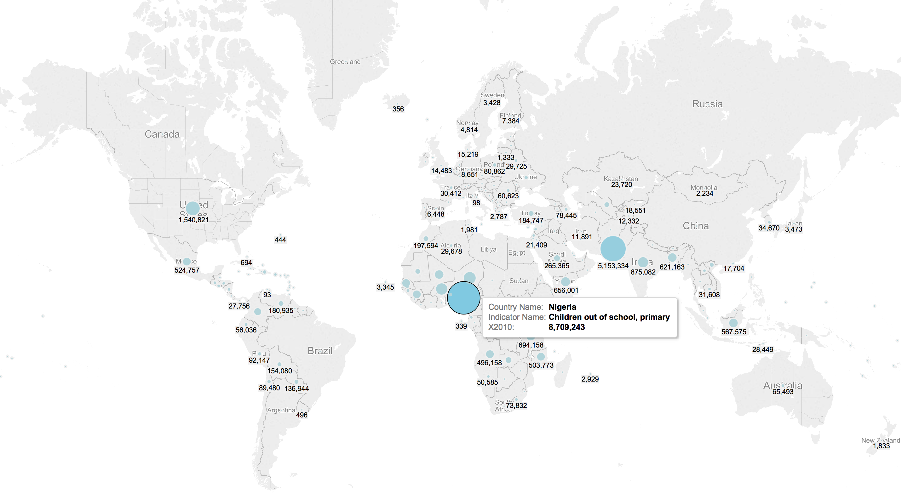

***
#How to Reproduce Our Work:
Step 1: Create GitHub Repo with necessary folders for partners to collaborate
      00 Doc contains the .Rmd and HTML files
      01 Data contains the data set that was worked with
      02 Shiny contains the server and user interface (ui) for the Shiny App
Step 2: Use an interesting data set with data that may be easily and interestingly manipulated
Step 3: Import the csv file into SQL Developer
Step 4: Save your app's server.R and ui.R script inside the 02 Shiny folder
Step 5: Launch the shinyApp with runApp and exit by clicking escape

***

#Data Summary:
Below is the dataset and first ten rows
```{r}
require("jsonlite")
require("RCurl")
require(ggplot2)
require(dplyr)

df <- data.frame(fromJSON(getURL(URLencode('skipper.cs.utexas.edu:5001/rest/native/?query="select * from edudata"'),httpheader=c(DB='jdbc:oracle:thin:@sayonara.microlab.cs.utexas.edu:1521:orcl', USER='C##cs329e_gmg954', PASS='orcl_gmg954', MODE='native_mode', MODEL='model', returnDimensions = 'False', returnFor = 'JSON'), verbose = TRUE)), ignoreNULL = FALSE)

head(df)
``` 
###Data Explanation and Overal Manipulation:

Education is one of the most powerful instruments for reducing poverty and inequality and lays a foundation for sustained economic growth. The World Bank compiles data on education inputs, participation, efficiency, and outcomes. This data on education was compiled by the United Nations Educational, Scientific, and Cultural Organization (UNESCO) Institute for Statistics from official responses to surveys and from reports provided by education authorities in each country.

Below are all of the key indicators from our project:
```{r}
require("jsonlite")
require("RCurl")
require(ggplot2)
require(dplyr)

df <- data.frame(fromJSON(getURL(URLencode('skipper.cs.utexas.edu:5001/rest/native/?query="select distinct(indicator_name) from edudata order by indicator_name desc"'),httpheader=c(DB='jdbc:oracle:thin:@sayonara.microlab.cs.utexas.edu:1521:orcl', USER='C##cs329e_gmg954', PASS='orcl_gmg954', MODE='native_mode', MODEL='model', returnDimensions = 'False', returnFor = 'JSON'), verbose = TRUE)), ignoreNULL = FALSE)

head(df)
``` 

***

#Shiny Methodology
* Shiny is an R package that makes it easy to build interactive web applications (apps) straight from R.
* Shiny ui.R scripts use the function fluidPage to create a display that automatically adjusts to the dimensions of your user’s browser window. You lay out your app by placing elements in the fluidPage function.The user-interface (ui) script controls the layout and appearance of your app. It is defined in a source script named ui.R. Additionally, the server.R script contains the instructions that your computer needs to build your app.
* Most of the script is wrapped in a call to renderPlot. This is an expression that generates a histogram. renderPlot indicates that the expression is "reactive" and should automatically re-execute whenver input changes. It also specifies that the output type is a plot.

### Shiny App Walkthrough:
* link to our app:
* Dashboard App:
  + Bar Chart
  + Cross Tab + KPI
  + Scatter Plot


***

#Visualizations:

***

#BoxPlot of Student-Teacher Ratios (Methodology Step One)


### Data Summary:


This box plot shows the student-teacher ratios for the years 2000 and 2012 for both primary and secondary schools.  We can see that in both years the student-teacher ratio for secondary schools is smaller than primary schools.  We also can see that there has been an imporvement in student teacher ratios from 2000 to 2012.  The interquartiles range has also decreased which means there is less spread in the data.


***

#Histogram of Student-Teacher Ratios (Methodology Step Two)

### Data Summary:

This histogram shows the student teacher ratio's in 2000.  This graph shows that the student teacher ratios have a left skewed model.  Most countries fall under the 10-30 ratio bin.  However, some countries push extremely high ratios of 60 students per teacher.  One country has a student teacher ratio of under 10.



***

#Scatter Plot of Student Teacher Ratios (Methodology Step Three)

### Data Summary:

(Also on Dashboard)

This scatterplot juxtaposes student teacher ratios from primary education to secondary education.  From the years 2000 to 2012, we can see that values on the plot have a linear trend.  The values that lie under the trend line depict an overall decrease in student teacher ratios (which is good).  The average student teacher ratio for primary education is 27.7 and secondary educaiton is 18.2. This is expected because higher education usually tends to have more teachers per student.


***

#CrossTab of Pupil-Teacher Ratios (Methodology Step Four)

### Data Summary:

This crosstab shows which countries have some of the higher pupil-teacher ratio's. Central African Republic has the highest ratio with about 80 students per teacher in primary education and 68 students per teacher in secondary education.   This cross tab only shows those with ratios greater than 45 in primary education.  The color represents the mins and maxes of the data displayed.  



*** 

#Map of Student Teacher Ratios (Methodology Step Five)

### Data Summary:

This map shows geographically where the lowest and highest pupil teacher ratio's exist.  We can see that the highest values come from African nations with other high values in Central America and South Eastern Asian countries.  Europe, US, and East Asia have some of the lowest ratio's, likely due to greatest economic development.


*** 

#Graph_title

### Data Summary:


*** 

#Graph_title

### Data Summary:



*** 


*** 

#Graph_title

### Data Summary:


*** 

#Graph_title

### Data Summary:


*** 

#Graph_title

### Data Summary:


*** 

#Graph_title

### Data Summary:


*** 

#Graph_title

### Data Summary:


*** 

#Graph_title

### Data Summary:


*** 
